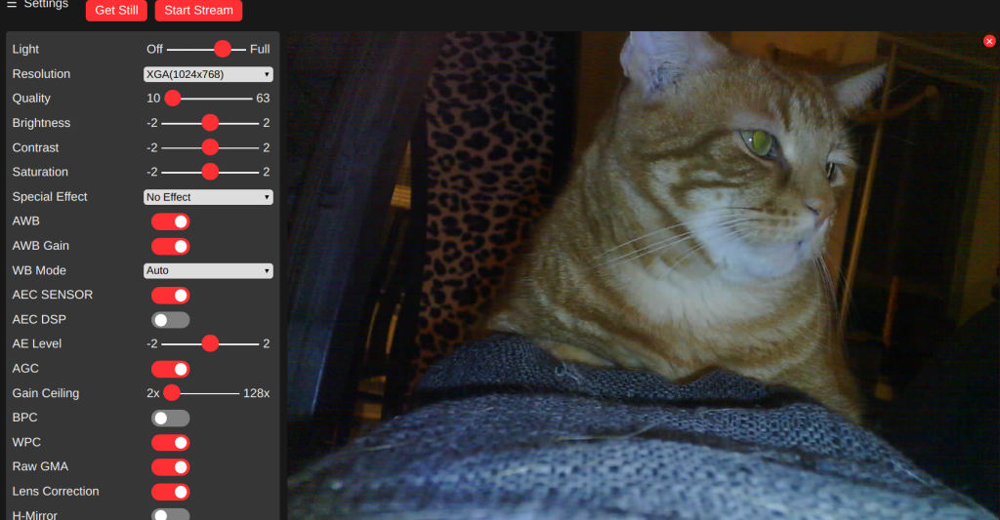

# Espressives ESP32-CAM example revisited.
## Taken from the ESP examples, and modified for reality
This sketch is a extension/expansion/rework of the 'official' ESP32 Camera example sketch from Espressif:

https://github.com/espressif/arduino-esp32/tree/master/libraries/ESP32/examples/Camera/CameraWebServer

- The example they have is nice, but a bit incomprehensible and hard to modify as supplied. It is very focused on showing off the face recognition capabilities, and forgets the 'webcam' part.
- There are many other variants of a webcam server for these modules online, but most are created for a specific scenario and not good for general, casual, webcam use.

Hopefully this expanded example is more useful for those users who wish to set up a simple ESP32 based webcam using the cheap(ish) modules freely available online. Especially the AI-THINKER board:

#### AI-THINKER ESP32-CAM vs Other Modules:

I have four of the AI-THINKER boards, so the descriptions below are for that board. But I took care to leave the default definitions and controls for other boards in the example intact. You may need to adjust the programming method to suit the your board, look for examples online.

* For some other good examples and information on ESP32 based webcams I also recommend the sketches here:
https://github.com/raphaelbs/esp32-cam-ai-thinker

* The AI thinker wiki can be quite informative, when run through an online translator and read sensibly:
https://wiki.ai-thinker.com/esp32-cam

## Setup:

* For programming you will need a suitable development environment, I use the Arduino IDE, but this code should work in the Espressif development environment too.
* Follow [This Guide](https://github.com/espressif/arduino-esp32/blob/master/docs/arduino-ide/boards_manager.md) to set up the Espressif Arduino core in the IDE.
* The AI-THINKER board requires use of an external **3.3v** serial adapter to program; I use a `FTDI Friend` adapter, for more about this read AdaFruits excellent [FTDI Friend guide](https://learn.adafruit.com/ftdi-friend). 
* Be careful not to use a 5v serial adapter since this will damage the ESP32.

### Wiring

Is pretty simple, see the diagram below.

* Connect the **RX** line from the serial adapter to the **TX** pin on ESP32
* The adapters **TX** line goes to the ESP32 **RX** pin
* The **GPIO0** pin of the ESP32 must be held LOW (to ground) when the unit is powered up to allow it to enter it's programming mode. This can be done with simple jumper cable connected at poweron, fitting a switch for this is useful if you will be reprogramming a lot.
* You must supply 5v to the ESP32 in order to power it during programming, the FTDI board can supply this.

### Config

You need to set the Board you are using in the main `esp32-cam-webserver.ino` sketch file, it defaults to the AI-THINKER, but the WRover Kit, ESP Eye and M5Stack are also availiable.

You can also set the camera name plus SSID and password for your WiFi network in that file, or follow the notes about using a separate file for your settings.

### Programming 

Assuming you are using the latest Espressif Arduino core the AI-THINKER board will appear in the ESP32 Arduino section of the boards list. 

Compile and upload the code from the IDE, while keeping **GPIO0** grounded. Open the serial monitor; you should see the board start, begin connecting to the wifi, connect and then report the IP address it has been assigned.

Go to the URL given in the serial output, the web UI should appear with the settings panel open. Click away!

## My Modifications:
The basic example is extended to allow control of a high power LED FlashLamps like the ones used on mobile phones, which are present on some modules. It can also blink a status LED to show when it connects to WiFi.

The WiFi details can be stored in an (optional) header file to allow easier further development, and a camera name for the UI title can be configured. The lamp and status LED's are optional, and the lamp uses a exponential scale for brightness so that the control has some finess.

The compressed and binary encoded HTML used in the example has been unpacked to raw text, this makes it much easier to access and modify the Javascript and UI elements. Given the relatively small size of the index page there is very little benefit from compressing it.

I have left all the Face Recognition code untouched, it works, and with good lighting and camera position it can work quite well. But you can only use it in low-resolution modes, and it is not something I wil be using.

The web UI has had minor changes to add the lamp control (only when enabled), I also made the 'Start Stream' and 'Snapshot' controls more prominent, and added feedback of the camera name + firmware.

## Notes: 
* I only have AI-THINKER modules with OV2640 camera installed; so I have only been able to test with this combination. I have attempted to preserve all the code for other boards and the OV3660 module, and I have merged all changes for the WebUI etc, but I cannot guarantee operation for these.
* I created a small board with a handy switch for power, a pushbutton for the GPIO0 programming switch, and a socket for the AI-THINKER board. This proved very useful for development work and programming multiple devices.
* I found some excellent [cases on Thingieverse](https://www.thingiverse.com/thing:3708345).

## Plans
* Improve Wifi, add a captive portal for setup and fallback, better disconnect/reconnect behaviour.
* The module has a SD/TF card slot; this is currently unused, but I would like to add the ability to store snapshots; recording Video at low resolution may be possible, but the card interface is too slow for HD video as far as I know.
* Remove face rcognition to save a Mb+ of code space and then implement over the air updates.
* Combine current split html pages (one per camera type) into one which adapts as needed.