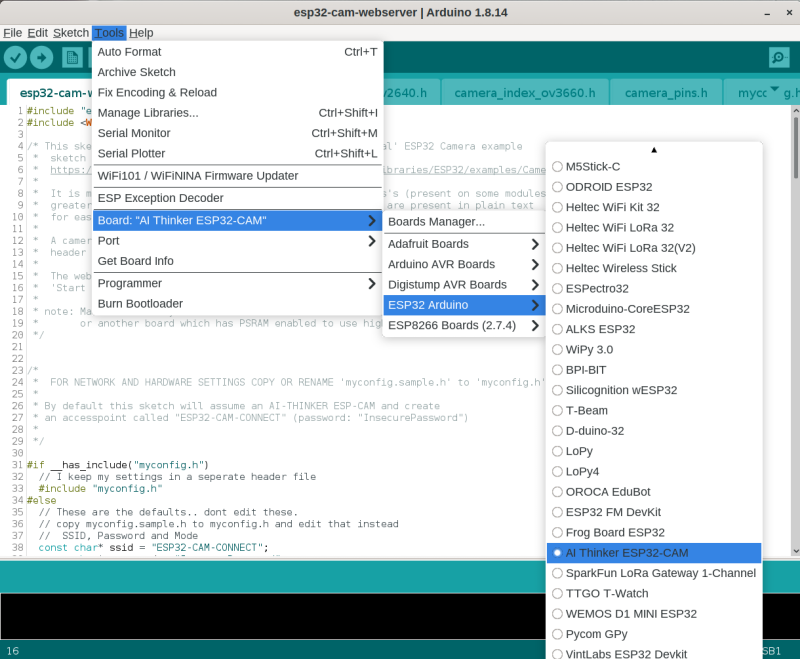
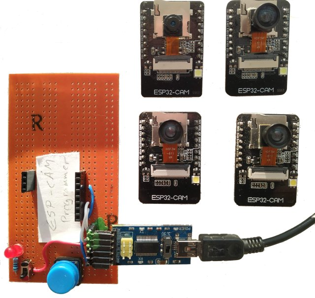

# ESP32-CAM example revisited. &nbsp;&nbsp;&nbsp;  &nbsp;&nbsp; 

## Taken from the ESP examples, and modified for reality
This sketch is a extension/expansion/rework of the 'official' ESP32 Camera example sketch from Espressif:

https://github.com/espressif/arduino-esp32/tree/master/libraries/ESP32/examples/Camera/CameraWebServer

- The example they have is nice, but a bit incomprehensible and hard to modify as supplied. It is very focused on showing off the face recognition capabilities, and forgets the 'webcam' part.
- There are many other variants of a webcam server for these modules online, but most are created for a specific scenario and not good for general, casual, webcam use.

Hopefully this expanded example is more useful for those users who wish to set up a simple ESP32 based webcam using the cheap(ish) modules freely available online. Especially the AI-THINKER board:

#### AI-THINKER ESP32-CAM vs Other Modules:

I have four [AI-THINKER ESP32-CAM](https://github.com/raphaelbs/esp32-cam-ai-thinker/blob/master/assets/ESP32-CAM_Product_Specification.pdf) boards, so the descriptions below are for that board. But I took care to leave the default definitions and controls for other boards in the example intact. You may need to adjust the programming method to suit the your board, look for examples online.

* For some other good examples and information on ESP32 based webcams I also recommend the sketches here:
https://github.com/raphaelbs/esp32-cam-ai-thinker
* The AI thinker wiki can be quite informative, when run through an online translator and read sensibly:
https://wiki.ai-thinker.com/esp32-cam
* Default pinouts are also included for WRover Kit, ESP Eye and M5Stack esp32 camera modules. 
  I do not have any of these boards, so they are untested by me. Please [let me know](https://github.com/easytarget/esp32-cam-webserver/issues) if you find issues or have a board not [in the list](./camera_pins.h).

## Troubleshooting:

Please read this excellent guide for help with all the common issues:
https://randomnerdtutorials.com/esp32-cam-troubleshooting-guide/

## Setup:

* For programming you will need a suitable development environment, I use the Arduino IDE, but this code should work in the Espressif development environment too.
* Make sure you are using the [latest version](https://www.arduino.cc/en/main/software#download) of the IDE and then follow [This Guide](https://github.com/espressif/arduino-esp32/blob/master/docs/arduino-ide/boards_manager.md) to set up the Espressif Arduino core for the IDE.
* If you have a development board (anything that can be programmed via a standard USB cable/jack on the board itself) you are in luck. Just plug it in and skip ahead to the [config](#config) section. Remember to set your board model.
* The AI-THINKER board requires use of an external **3.3v** serial adapter to program; I use a `FTDI Friend` adapter, for more about this read AdaFruits excellent [FTDI Friend guide](https://learn.adafruit.com/ftdi-friend).
* Be careful not to use a 5v serial adapter since this will damage the ESP32.

### Wiring for AI-THINKER Boards (and similar clone-alikes)

Is pretty simple, You just need jumper wires, no soldering really required, see the diagram below.

* Connect the **RX** line from the serial adapter to the **TX** pin on ESP32
* The adapters **TX** line goes to the ESP32 **RX** pin
* The **GPIO0** pin of the ESP32 must be held LOW (to ground) when the unit is powered up to allow it to enter it's programming mode. This can be done with simple jumper cable connected at poweron, fitting a switch for this is useful if you will be reprogramming a lot.
* You must supply 5v to the ESP32 in order to power it during programming, the FTDI board can supply this.

### Config

By default the sketch assumes you have an AI-THINKER board, it creates an AccessPoint called `ESP32-CAM-CONNECT` and with the password `InsecurePassword`; connect to that and then browse to [`http://192.168.4.1/`](http://192.168.4.1/). This is nice and easy for testing and demo purposes.

To make a permanent config for a different board, or with your home wifi settings etc. copy (or rename) the file `myconfig.sample.h` in the sketch folder to `myconfig.h` 

You can now set a camera name, board model, wifi settings and some other defaults in that file. And because this is your private copy it will not get overwritten if you update the main sketch!

### Programming 

Assuming you are using the latest Espressif Arduino core the AI-THINKER board (or whatever you use) will appear in the ESP32 Arduino section of the boards list. 

Compile and upload the code from the IDE, when the `Connecting...` appears in the console reboot the ESP32 module while keeping **GPIO0** grounded. You can release GPO0 once the sketch is uploading, most boards have a 'boot' button to trigger a reboot.

Once the upload completes (be patient, it can be a bit slow) open the serial monitor in the IDE and reboot the board again without GPIO0 grounded. In the serial monitor you should see the board start, connect to the wifi and then report the IP address it has been assigned.

If you have a status LED configured it will give a single slow flash when it begins attempting to conenct to WiFi, and three short flashes once it has succeeded. It will also flash briefly when you access the camera to change settings.

Go to the URL given in the serial output, the web UI should appear with the settings panel open. Click away!

## My Modifications:

The basic example is extended to allow control of a high power LED FlashLamps, which are present on my modules. It can also blink a status LED to show when it connects to WiFi.

The WiFi details can be stored in an (optional) header file to allow easier code development, and a camera name for the UI title can be configured. The lamp and status LED's are optional, and the lamp uses a exponential scale for brightness so that the control has some finess.

The compressed and binary encoded HTML used in the example has been unpacked to raw text, this makes it much easier to access and modify the Javascript and UI elements. Given the relatively small size of the index page there is very little benefit from compressing it.

I have left all the Face Recognition code untouched, it works, and with good lighting and camera position it can work quite well. But you can only use it in low-resolution modes, and it is not something I will be using.

The web UI has had minor changes to add the lamp control (only when enabled), I also made the 'Start Stream' and 'Snapshot' controls more prominent, and added feedback of the camera name + firmware.

I would also like to shoutout to @jmfloyd; who suggested rotating the image in the browser since the esp32 itself cannot do this.

## Notes: 

* I only have AI-THINKER modules with OV2640 camera installed; so I have only been able to test with this combination. I have attempted to preserve all the code for other boards and the OV3660 module, and I have merged all changes for the WebUI etc, but I cannot guarantee operation for these.
* I created a small board with a handy switch for power, a pushbutton for the GPIO0 programming switch, and a socket for the AI-THINKER board. This proved very useful for development work and programming multiple devices.
* I found some excellent [cases on Thingieverse](https://www.thingiverse.com/thing:3708345).

## Contributing

Contributions are welcome!

To make a PR please first fork the repo in github, and make a branch in that fork with a sensible name. Apply your changes to that branch (and test if you can), commit and then create a PR to merge to a branch of the same name in my repo.

Please do not submit PR's onto the master branch of my repo unless they are very trivial (spellings etc). Make sure your changes are consistent with the style and purpose of the existing code; and provide a coherent explanation of what/why in the PR. 

## Plans

You can check the [enhancement list](https://github.com/easytarget/esp32-cam-webserver/issues?q=is%3Aissue+label%3Aenhancement) (past and present), and add any thoghts you may have there. Things that have occurred to me are, in no particular order:
* Improve Wifi, add a captive portal for setup and fallback, better disconnect/reconnect behaviour.
* The module has a SD/TF card slot; this is currently unused, but I would like to add the ability to store snapshots; recording Video at low resolution may be possible, but the card interface is too slow for HD video as far as I know.
* Remove face rcognition to save a Mb+ of code space and then implement over the air updates.
* Combine current split html pages (one per camera type) into one which adapts as needed.
